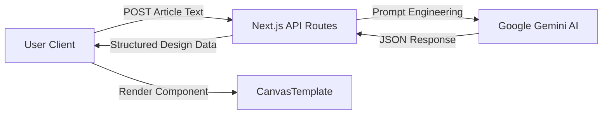

# Architecture Overview

CanvasAI Designer is built as a **Modern Monolithic Web Application** using the Next.js App Router architecture. It emphasizes simplicity, performance, and type safety.

## 🏗️ System Architecture

### High-Level Overview



### Directory Structure

The project follows the standard Next.js 14 App Router convention:

```
CanvasAI/
├── app/
│   ├── api/generate/      # Serverless function for AI processing
│   ├── components/        # Shared UI components (CanvasTemplate, etc.)
│   ├── layout.tsx         # Root layout and metadata
│   └── page.tsx           # Main application logic and state
├── public/                # Static assets
└── types/                 # (Implicit) TypeScript interfaces
```

## 🔌 Data Flow & Logic

### 1. The Generation Pipeline (`/api/generate`)
The core intelligence lives in the backend API route. 
- **Input Validation**: Ensures the user provides sufficient context (min 20 chars).
- **Prompt Engineering**: We construct a specific multi-shot prompt for Gemini that instructs it to act as a "Senior Graphic Designer".
- **Structured Output**: The AI is forced to return a pure JSON object containing:
  - `title`: Catchy headline
  - `quote`: Viral-worthy excerpt
  - `imageDescription`: detailed prompt for image generation
  - `colorScheme`: Hex codes for the design palette
- **Error Handling**: A robust fallback mechanism ensures the user always gets a design, even if the AI service is interrupted.

### 2. Frontend State Management (`page.tsx`)
The frontend is a Client Component that manages the intricate state of the design process:
- `articleText`: Raw user input.
- `result`: The trusted source of truth for the currently displayed design.
- `history`: A local session history stack allowing users to revert to previous designs.

### 3. Rendering Engine (`CanvasTemplate`)
This is a specialized React component designed to be visually flexible. It accepts the `template` configuration (colors, text) and dynamically styles itself using inline styles and Tailwind utility classes to match the AI's vision.

## 🔐 Security & configuration

- **Environment Variables**: Sensitive keys (Google AI API Key) are kept server-side in `.env.local` and never exposed to the client bundle.
- **Input Sanitization**: Basic validation prevents empty or malicious payloads from wasting API tokens.

## 🚀 Future Scalability

While currently a single Next.js app, the architecture allows for easy decoupling:
- The `CanvasTemplate` can be extracted to a shared UI library.
- The `api/generate` logic can be moved to a standalone microservice or Edge Function if throughput increases.
